# 南看台前端 / Tifo Frontend

南看台（Tifo）是一款**卡片化足球内容流 + 赛事数据 + 社区互动** App。本仓库为前端工程，包含面向普通用户的 Flutter 移动客户端，以及仅供内部管理员使用的 Vue 管理后台。

后端仓库：[violet-hekmatyar/Tifo](https://github.com/violet-hekmatyar/Tifo)

## 产品形态

| 端 | 说明 | 路径 |
|---|---|---|
| 移动客户端（Android） | 用户主端，全部业务功能 | `apps/mobile/` |
| 管理后台（Web） | 内部管理员内容/用户管理 | `apps/admin/` |

当前不建设面向用户的 H5、PWA 或小程序。

## 已实现功能

### 账号与首次偏好

- 用户名密码注册 / 登录，JWT 会话保持与过期引导
- 登录前用户协议与隐私政策弹层确认
- 首次进入选择主队、关注球队与关注球星（可随时返回修改）

| 登录 | 首次偏好选择 |
|---|---|
| 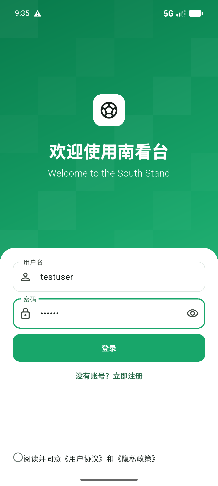 | 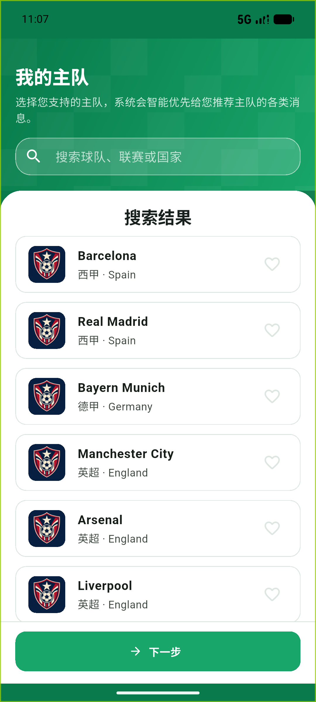 |

### 首页推荐流

- 混合信息流：比赛卡、图文资讯、**转会快讯**、积分榜、赛后球员评分、话题讨论、热门评论，按后端组合策略双列瀑布呈现
- 频道切换：推荐 / 资讯 / 关注；顶部关注球队快捷筛选（横向滚动、完整队名）
- 搜索与发布入口常驻；比赛卡区分进行中 / 未开始（含日期）/ 已结束

| 推荐流 | 未开始比赛日期显示 |
|---|---|
| 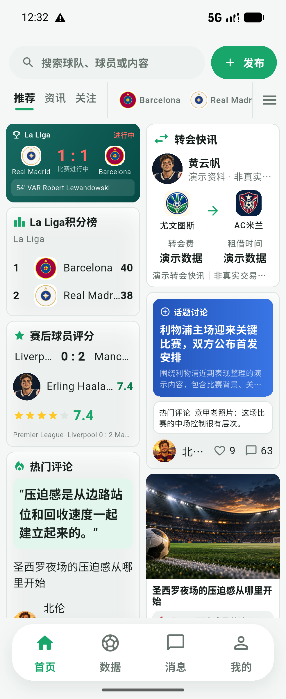 | 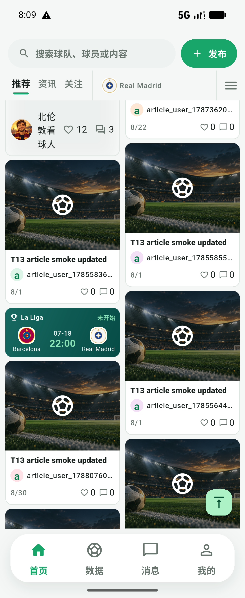 |

### 数据中心

- 重要 / 关注两个视角，联赛 / 欧冠 / 杯赛三类赛事入口
- 单行文字球队筛选（选中实心、横向滚动）
- 赛程按"进行中 → 未开始 → 已结束"分组排序；积分榜 / 球员榜 / 球队榜
- 杯赛淘汰树入口（当前为"正在开发"占位页，见未实现功能）

| 数据页（关注 + 球队筛选） |
|---|
| 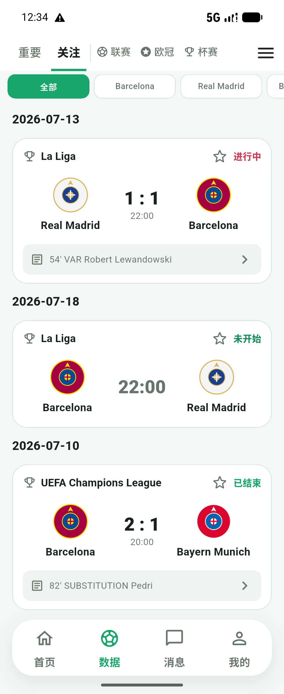 |

### 比赛 / 球队 / 球员详情

- 比赛详情：总览、事件、统计、**阵型阵容**（双方 11 人按阵型落位）、赛后评分
- 球队详情：总览（下一场、赛事排名、最新资讯）、帖子、球员、数据、赛程
- 球员详情：总览、动态、比赛、数据、生涯（按球队 / 赛季）

| 比赛总览 | 阵型阵容 | 球队详情 | 球员详情 |
|---|---|---|---|
| 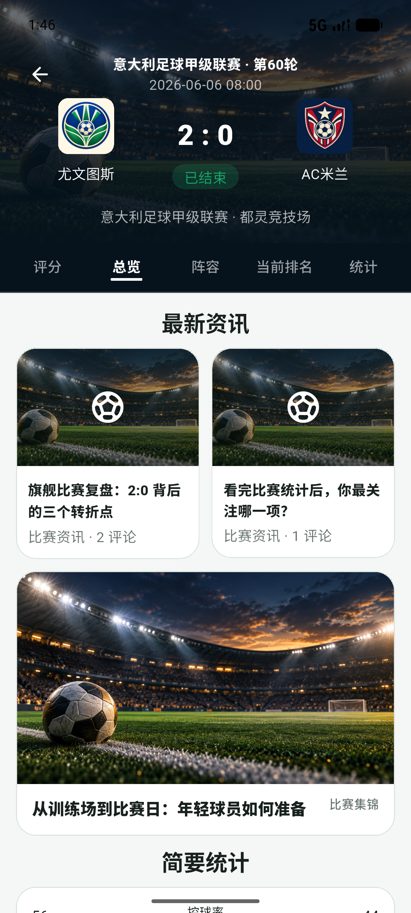 | 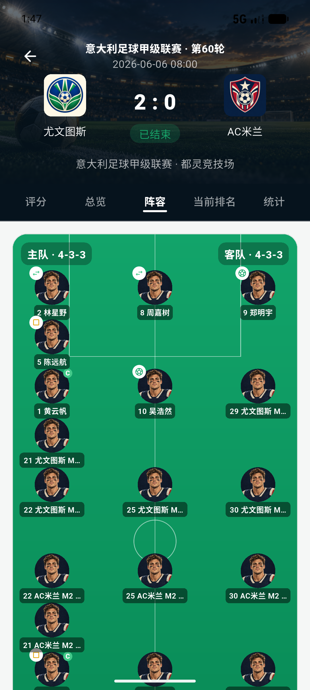 | 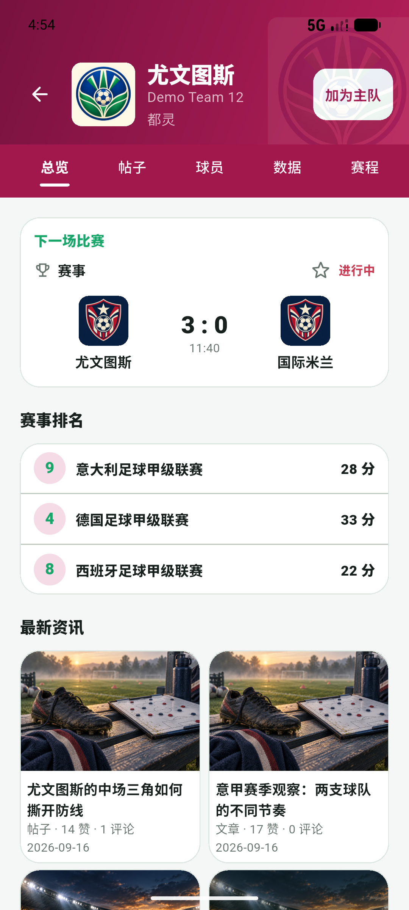 | 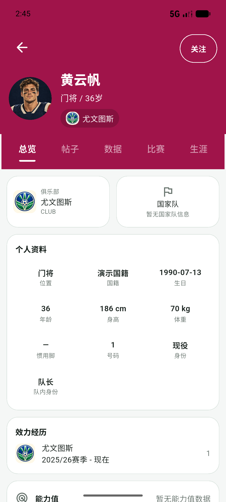 |

### 内容与社区互动

- 内容详情（图文 / 文章）、评论区与发表评论、点赞 / 收藏、分享面板
- 发布：帖子与文章两种编辑器，支持图片、话题与热点关联
- 全局搜索（球队 / 球员 / 内容），搜索空态引导

| 内容详情 | 评论区 | 发布编辑器 | 搜索 |
|---|---|---|---|
|  | 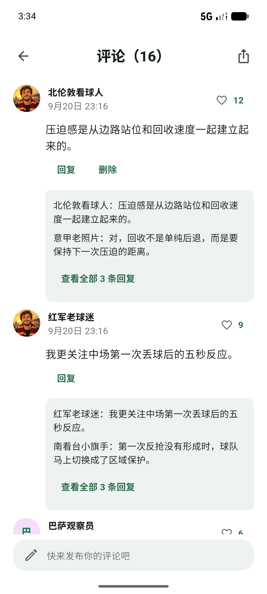 | 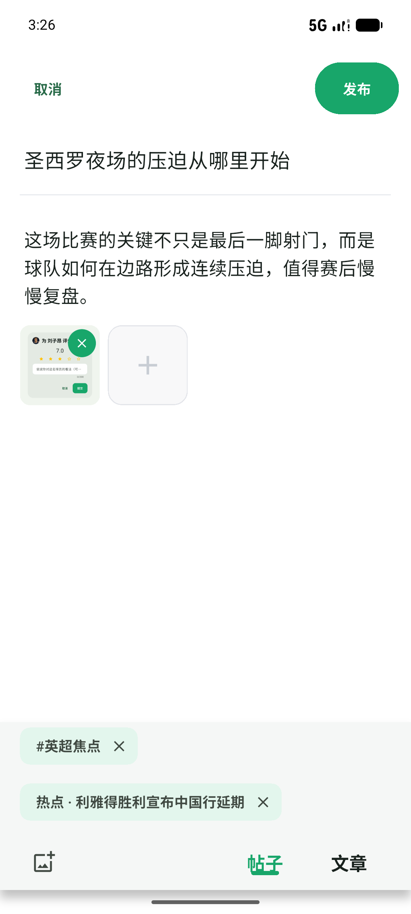 | 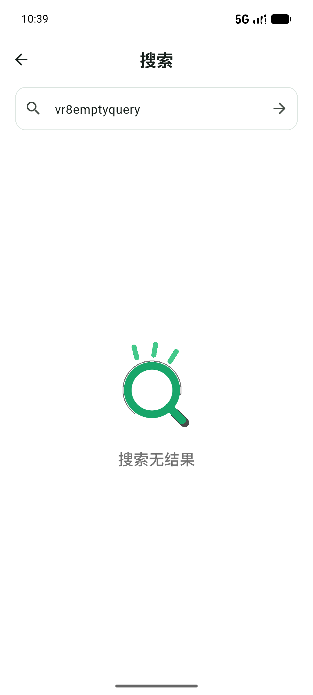 |

### 用户中心与消息

- 我的：看台（主队 / 关注的球队 / 关注的球星）、发布 / 点赞 / 收藏 / 评论分页列表
- 关注与粉丝列表、关注 / 取关、公开用户主页
- 消息中心：互动通知（点赞等）
- 设置与账号安全

| 我的 | 关注列表 | 消息 | 设置 |
|---|---|---|---|
| 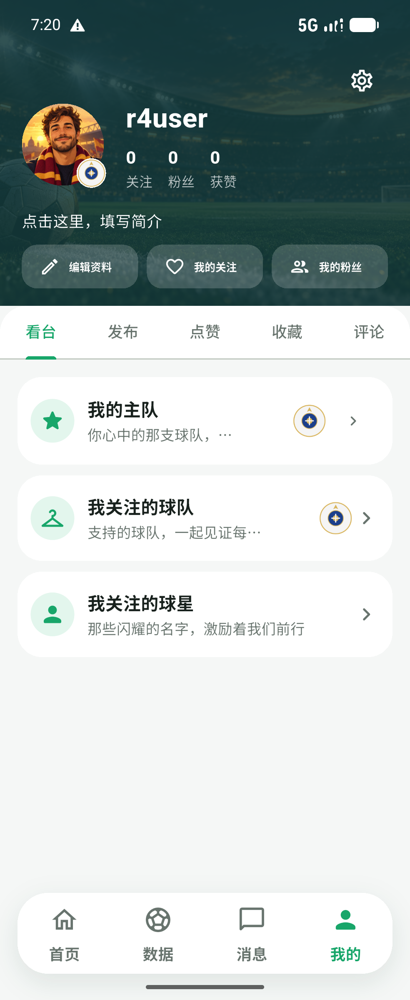 | 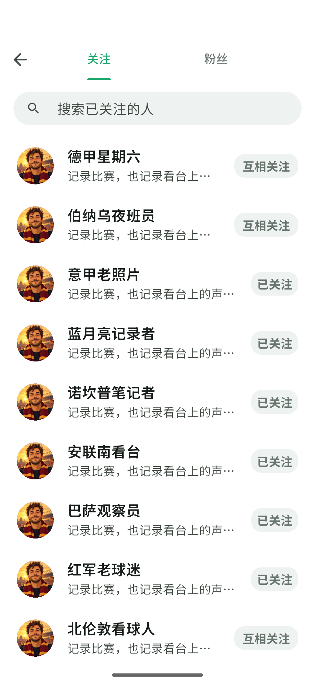 | 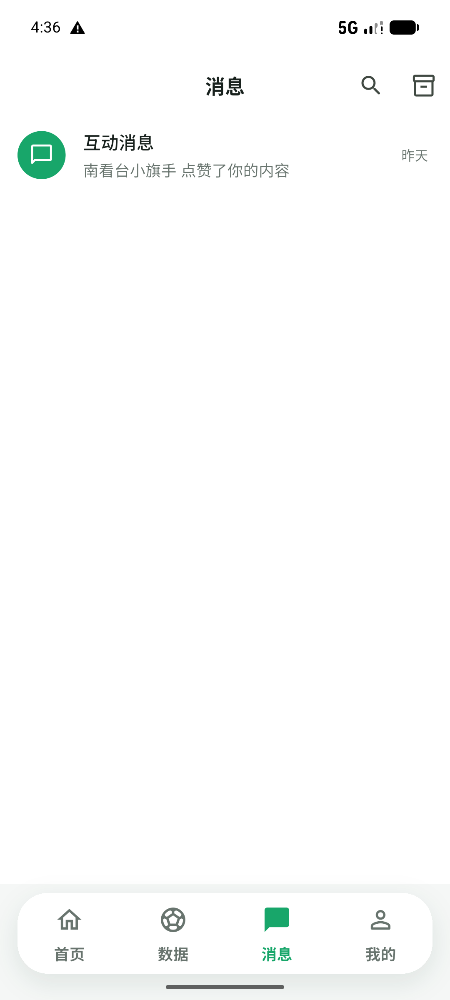 | 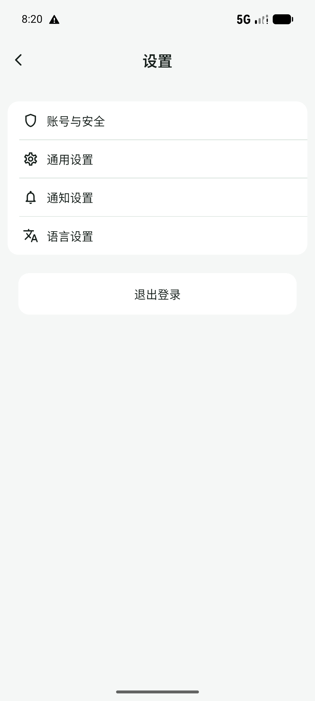 |

### 工程与体验能力

- 全部页面由真实后端 API 驱动，不在客户端写死业务数据；演示数据均明确标注"演示"
- 统一空态插画体系（加载 / 空 / 错误 / 重试 / 无权限）
- 媒体降级：图片缺失或失败时使用本地中性占位图，不影响布局
- 响应式：360dp 窄屏与 140% 大字体验证无溢出、无遮挡
- 视觉以原型逐页验收：60 张原型 53 张通过、7 张既定排除、0 未决

| 空态插画体系 |
|---|
| 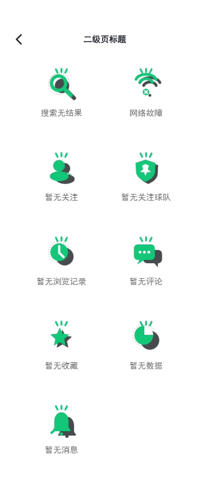 |

## 未实现功能

以下能力**本期明确不实现**，客户端不提供入口或显示占位，不以假接口伪装完成：

- 手机号验证码登录 / 一键手机号登录
- 微信登录
- 私信、聊天会话、IM
- WebSocket 与 Push 推送
- 注销账号、修改密码
- **完整杯赛淘汰树**（后续独立专项：当前仅保留入口与"正在开发"占位页，需后端先建设淘汰树数据模型与查询接口）

已知登记项（不影响使用，见 `reports/VR14_R4_FINAL_EVIDENCE/HOME_DATA_DEVIATION_TABLE.md`）：数据页比赛卡暂无"轮次"信息（后端契约未提供该字段）、数据页日期分组为状态优先排序（产品决策待定）。

## 技术栈（简要）

- 移动客户端：Flutter 3.44 + Dart 3.12，Riverpod 状态管理，go_router 路由
- 管理后台：Vue 3 + TypeScript + Element Plus
- 接口契约以后端 Backend V1 为权威，前端只消费不修改

## 快速开始

```powershell
# 移动客户端（需先启动后端，见后端仓库 README）
cd apps/mobile
flutter pub get
flutter run --debug `
  --dart-define=APP_ENV=development `
  --dart-define=API_BASE_URL=http://10.0.2.2:8080

# 管理后台
cd apps/admin
npm ci
npm run dev
```

## 文档入口

- 文档地图：[docs/00_DOCUMENT_MAP.md](docs/00_DOCUMENT_MAP.md)
- 项目接手简报：[PROJECT_HANDOFF_KIMI.md](PROJECT_HANDOFF_KIMI.md)
- 验收报告与证据索引：[reports/README.md](reports/README.md)
