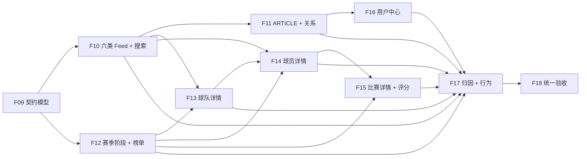

# Backend V1 冻结后前端需求补齐计划

> 性质：静态、只读代码审计与后续开发计划。本文没有实施任何功能。

## 1. Executive Summary

当前 Flutter 已形成“注册登录 → 首次设置 → 首页 CONTENT/MATCH Feed → 帖子详情/发布/互动 → 基础足球数据 → 用户中心”的可运行主链，但还没有完成 Backend V1 已冻结能力的全面接入。

- 本次矩阵共 78 条；排除或延期 9 条，当前有效范围 69 条。
- 其中 27 条达到“正式 UI + 真实接口 + 主流程闭环”，完整闭环率为 **39%（27/69）**。
- 另有 3 条基本完成、1 条部分完成、24 条未实现、14 条仍是基于旧后端结论的过时实现。
- 需要后续开发的前端缺口共 **42 条**：P0 33 条、P1 8 条、P2 1 条。
- Backend V1 支持范围内 68/69 条；剩余 1 条是 PDF 的“最多关注五支球队”与冻结口径冲突，Backend V1 明确采用“不设上限”，不属于后端缺口。
- 历史报告中“后端缺积分榜、球员榜、球队榜、球队阵容、球员统计/比赛/生涯、比赛阵容/统计/评分、我的点赞、ARTICLE 和搜索”等结论已全部失效。
- 通知中心虽然后端已实现，但前端尚未实现，按用户要求与私信、聊天、IM、WebSocket、Push 一并排除，不计 42 条缺口，也不安排开发阶段。
- 建议用 **F09-F18 共 10 个阶段**完成不含通信功能的第一版：先收口公共契约，再依次完成 Feed/Search、ARTICLE、数据榜单、球队、球员、比赛、用户中心、推荐行为，最后统一验收。

Backend V1 已足以支撑本计划。除非联调证明冻结实现存在真实 Bug，后续阶段只改前端，不规划新的 Java、SQL、migration、seed 或数据源工作。

## 2. 审计基线

| 项目 | 实际基线 |
|---|---|
| 前端仓库 | `D:\Football-APP-Front` |
| 前端分支 / HEAD | `main` / `92c42f6`（`feat: add Vue admin authentication and shell`） |
| 前端工作区 | 非 clean；已有未跟踪报告和度量文件均为用户现有内容，本次未改动 |
| 后端仓库 | `D:\Football-APP` |
| 后端分支 / HEAD | `main` / `8fed05b`（`feat: complete T22 backend v1 final closure`） |
| 后端工作区 | 非 clean；`FRONTEND_BACKEND_HANDOFF_V1.md`、`FRONTEND_BACKEND_QUICKSTART_V1.md` 为已有未跟踪文档，本次未改动 |
| Backend V1 Freeze | 已确认冻结；冻结日期 2026-08-30，T00-T22 完成 |
| 原始需求 | `C:\Users\hekmatyar\Desktop\tifo需求文档.pdf`，实际读取 43 页 |
| 审计日期 | 2026-09-02 |

本次实际读取 Backend V1 的 `BACKEND_API_FREEZE_V1.md`、`FRONTEND_BACKEND_HANDOFF_V1.md`、`FRONTEND_BACKEND_QUICKSTART_V1.md`、`docs/06_API_SPEC.md`、`docs/07_AUTH_SECURITY.md`、`docs/11_VALIDATION_AND_SMOKE_GUIDE.md` 和 `docs/audits/T22_BACKEND_V1_FINAL_CLOSURE_REPORT.md`。同时检查了当前 Controller、Service、Mapper/Repository 以及 `SecurityConfig`，没有把文档中的规划路径直接当成真实能力。

前端读取了根 README、Flutter/Vue README、`docs/00` 至 `docs/11`、`docs/13`、F01-F08 阶段报告及既有 F01-F07 审计/能力矩阵/路线图，并直接核对 router、API、repository、controller/provider、domain、page 和 widget。

## 3. Backend V1 新增或变化能力

| 领域 | Backend V1 冻结事实 | 当前 Flutter 事实 |
|---|---|---|
| Feed | 六类 `CONTENT/MATCH/HOT_COMMENT/DISCUSSION/RANKING/PLAYER_RATING`，未知类型可扩展；tab 为 `recommend/news/following/team` | 只有 CONTENT/MATCH 正式模型和组件；其余四类进入 Unknown |
| 推荐归因 | 页面级 algorithm/model/experiment/request；卡片级 impression/position/reason | FeedPage/FeedCard 未保存这些字段 |
| 搜索 | `/api/app/search/entities` 支持 TEAM/PLAYER/MATCH/CONTENT 混合或分类搜索 | `/search` 仍为占位 |
| ARTICLE | 发布、编辑、blocks、relationList、coverFileId | 仅帖子发布；详情未解析 blocks；关系提交固定空数组 |
| 赛季与阶段 | leagues → seasons → stages | 只接 leagues |
| 排名 | standings、player-ranks、team-ranks | 均未接入 |
| 球队详情 | overview、players、stats、honors、matches、contents | 基础详情和通用赛程可用；阵容/数据仍写“后端未提供” |
| 球员详情 | overview、stats、teams、career、matches、contents | 仅基础详情和当前俱乐部可用；深度 Tab 仍为空 |
| 比赛详情 | overview、lineups、stats、player-stats、ratings、评分提交/撤销 | 仅基础详情、事件和战报；阵容/排名/统计仍为空，评分缺失 |
| 用户中心 | `/me/likes` 与 avatar bind 已补齐 | 点赞仍显示“后端未提供”；头像仅展示，不可更改 |
| 通知 | list、unread-count、read、read-all | 未实现，但按用户要求排除 |
| 推荐行为 | batch 接收 EXPOSE/CLICK/DETAIL/LIKE/FAVORITE/COMMENT | 当前无行为上报模块 |
| 推荐降级 | Python 不可用时 Java 降级 `RULE_V2` | Flutter 只应访问 Spring Boot，页面不得依赖 Python 在线 |

实际闭环证据包括：`FeedController → FeedService`；`SearchController → SearchService → Content/Team/Player/Match Mapper`；`ContentController → ContentService → ContentBlock/Media/Relation Mapper`；球队/球员 Controller → `FootballDetailService` → 赛季球员、荣誉、统计、历史 Mapper；比赛 Controller → `MatchDataService/MatchOverviewService` → lineup/team-stat/player-stat/rating Mapper；用户 Controller → `UserProfileService/FileBindingService`；行为 Controller → `RecommendationBehaviorService → UserBehaviorLogMapper`。

## 4. 历史结论修正

下列旧结论在 `main@98ca87f` 时成立，但在当前 `main@8fed05b` 已过时。后续 Prompt 不得继续以“需要后端新增”为前提。

| 旧结论 | 当前真实结论 | 依据 |
|---|---|---|
| 后端没有全局搜索 | 已支持四类实体与混合搜索 | T22 + `SearchController` |
| 后端没有 ARTICLE blocks/发布/编辑 | 已支持文章新增、编辑、分段和关系 | T13 + `ContentController/ContentService` |
| 后端没有赛季/阶段/积分榜/球员榜/球队榜 | 全部已提供冻结 GET 接口 | T15 + League/Rank Controller |
| 后端没有球队阵容、统计、荣誉和球队内容 | 已有 `/players`、`/stats`、`/honors`、`/contents` | T16/T20 + Team Controller |
| 后端没有球员国家队、统计、比赛和生涯 | overview 可含 nullable 国家队，另有 stats/teams/career/matches/contents | T16/T20 + Player Controller |
| 后端没有比赛阵容、统计与评分 | lineups/stats/player-stats/ratings 及评分增删均已支持 | T17/T20 + Match Controller |
| 后端没有“我的点赞” | `/api/app/users/me/likes` 已有真实分页闭环 | T13 + UserProfile Controller/Service |
| 后端只支持 CONTENT/MATCH | Feed 已支持六类卡片和推荐归因 | T18/T19 + Feed Service |
| 后端没有通知 | T21 已实现 | 本计划按用户要求排除，不转化为前端任务 |

文档与代码仍有五个必须按代码处理的差异：Result 实际顶层是 `code/message/data/traceId` 而非 timestamp；cardType 使用 `CONTENT/MATCH` 而非旧 `*_CARD`；Feed tab 不使用旧 `mixed/match`；球队关注不设五支硬上限；Match Overview 的 `CURRENT_STANDING` 是当前排名，不是赛前排名。

## 5. 逐需求功能矩阵

完整 78 条及备注见机器可读矩阵。本节用同一字段给出逐需求结论；“阶段为空”表示已完成或排除。

### 5.1 已完整闭环（27 条）

| 模块 | 需求 | 页码 | 前端状态 | Backend V1 | 实际接口摘要 | 缺口 | 需补 | 优先级 | 阶段 |
|---|---|---:|---|---|---|---|:---:|---|---|
| 认证 | 注册登录与会话 | 1 | 完整 | 支持 | auth register/login/me | 无 | 否 | P0 | — |
| 认证 | 主队、球队、球员首次设置 | 1 | 完整 | 支持 | onboarding options/preferences | 无 | 否 | P0 | — |
| 首页 | 四类 Feed 入口、热门联赛 | 2-5 | 完整 | 支持 | feed、hot-leagues | 无主流程缺口 | 否 | P0 | — |
| 首页 | CONTENT、MATCH、Unknown 降级 | 1-4 | 完整 | 支持 | feed | 无 | 否 | P0 | — |
| 内容 | 帖子发布、多图、详情、点赞收藏 | 6-7 | 完整 | 支持 | contents/posts、files、likes、favorites | 无 | 否 | P0 | — |
| 评论 | 根评论、回复、评论点赞、本人删除 | 8-9 | 完整 | 支持 | comments 系列 | 无 | 否 | P0 | — |
| 数据 | 重要比赛、联赛赛程 | 9-11 | 完整 | 支持 | matches/important、leagues、matches | 无 | 否 | P0 | — |
| 球队 | 基础信息与关注 | 16-18 | 完整 | 支持 | teams/{id}、follows/toggle | 无 | 否 | P0 | — |
| 球员 | 基础、退役、当前俱乐部 | 24-25 | 完整 | 支持 | players/{id} | 无 | 否 | P0 | — |
| 比赛 | 基础、事件、战报 | 28,31,34-35 | 完整 | 支持 | matches/{id} | 无 | 否 | P0 | — |
| 用户 | profile/summary/stand/编辑 | 38-39 | 完整 | 支持 | users/me 系列 | 无 | 否 | P0 | — |
| 用户 | 我的发布、收藏、评论 | 39 | 完整 | 支持 | users/me/contents/favorites/comments | 无 | 否 | P0 | — |
| 用户 | 公开主页与公开内容 | 40-41 | 完整 | 支持 | users/{id}/profile/contents | 无 | 否 | P0 | — |
| 文件 | 内容上传、读取、删除 | 6-7 | 完整 | 支持 | files/upload、public/files、files delete | 无 | 否 | P0/P1 | — |
| 管理后台 | F08 认证与框架 | 非 App 43 页 | 完整 | 支持 | auth + admin dashboard | 业务占位不阻塞 App | 否 | P2 | — |

### 5.2 需要补齐（42 条）

| 模块 | 需求 | 页码 | 前端状态 | Backend V1 | 实际接口 | 缺口 | 需补 | 优先级 | 阶段 |
|---|---|---:|---|---|---|---|:---:|---|---|
| 契约 | 五支球队规则 | 16 | 旧口径 | 不要求 | follows/toggle | PDF 与冻结规则冲突 | 是 | P1 | F09 |
| 首页 | 推荐归因字段 | 4-5 | 旧模型 | 支持 | feed | model 未保存字段 | 是 | P0 | F09 |
| 首页 | HOT_COMMENT | 1,4 | 未实现 | 支持 | feed | 无正式卡片 | 是 | P0 | F10 |
| 首页 | DISCUSSION | 3-4 | 未实现 | 支持 | feed | 无正式卡片 | 是 | P0 | F10 |
| 首页 | RANKING | 2-3 | 未实现 | 支持 | feed | 无正式卡片 | 是 | P0 | F10 |
| 首页 | PLAYER_RATING | 1,3 | 未实现 | 支持 | feed | 无正式卡片 | 是 | P0 | F10 |
| 搜索 | 四类聚合/分类搜索 | 2 | 未实现 | 支持 | search/entities | 路由是占位 | 是 | P0 | F10 |
| 搜索 | 分页与四类跳转 | 2 | 未实现 | 支持 | search/entities | 无模型/状态/路由编排 | 是 | P0 | F10 |
| 内容 | ARTICLE 发布 | 6-7 | 未实现 | 支持 | POST contents/articles | 无创作页 | 是 | P0 | F11 |
| 内容 | ARTICLE 编辑 | 6-7 | 未实现 | 支持 | PUT contents/{id}/articles | 无编辑闭环 | 是 | P1 | F11 |
| 内容 | blocks 编排/渲染 | 6-7 | 旧实现 | 支持 | detail + articles | 未解析 blocks | 是 | P0 | F11 |
| 内容 | 实体关系选择 | 7 | 部分 | 支持 | contents + search | 发布固定空 relationList | 是 | P0 | F11 |
| 数据 | 关注球队二级筛选 | 10 | 基本 | 支持 | matches/following-teams | 未使用 teamId | 是 | P1 | F12 |
| 数据 | seasons/stages | 11-13 | 未实现 | 支持 | leagues/{id}/seasons/.../stages | API/model/UI 缺失 | 是 | P0 | F12 |
| 数据 | standings | 12-13 | 未实现 | 支持 | football/standings | 榜单全缺 | 是 | P0 | F12 |
| 数据 | player-ranks | 15 | 未实现 | 支持 | football/player-ranks | 榜单全缺 | 是 | P0 | F12 |
| 数据 | team-ranks | 15 | 未实现 | 支持 | football/team-ranks | 榜单全缺 | 是 | P0 | F12 |
| 球队 | overview | 17-18 | 旧实现 | 支持 | teams/{id}/overview | 仍拼旧 detail | 是 | P0 | F13 |
| 球队 | contents | 19-20 | 未实现 | 支持 | teams/{id}/contents | 无动态 Tab | 是 | P0 | F13 |
| 球队 | players | 22-23 | 旧空态 | 支持 | teams/{id}/players | 错称后端不支持 | 是 | P0 | F13 |
| 球队 | stats | 21 | 旧空态 | 支持 | teams/{id}/stats | 错称后端不支持 | 是 | P0 | F13 |
| 球队 | honors | 18-19 | 未实现 | 支持 | teams/{id}/honors | 无 UI | 是 | P1 | F13 |
| 球队 | matches 冻结端点 | 21 | 基本 | 支持 | teams/{id}/matches | 仍复用通用 matches | 是 | P1 | F13 |
| 球员 | overview/国家队 nullable | 25 | 旧实现 | 支持 | players/{id}/overview | 只消费基础详情 | 是 | P0 | F14 |
| 球员 | contents | 25 | 未实现 | 支持 | players/{id}/contents | 无动态 Tab | 是 | P0 | F14 |
| 球员 | stats | 26-27 | 旧空态 | 支持 | players/{id}/stats | 错称后端不支持 | 是 | P0 | F14 |
| 球员 | teams | 25,27 | 未实现 | 支持 | players/{id}/teams | 仅当前俱乐部 | 是 | P1 | F14 |
| 球员 | career | 27 | 未实现 | 支持 | players/{id}/career | 无生涯 Tab | 是 | P0 | F14 |
| 球员 | matches | 25-26 | 旧空态 | 支持 | players/{id}/matches | 错称后端不支持 | 是 | P0 | F14 |
| 比赛 | overview | 31,34-35 | 旧实现 | 支持 | matches/{id}/overview | 仍用旧 detail | 是 | P0 | F15 |
| 比赛 | lineups | 28,36 | 旧空态 | 支持 | matches/{id}/lineups | 错称后端不支持 | 是 | P0 | F15 |
| 比赛 | CURRENT_STANDING | 36-37 | 旧空态 | 支持 | overview.ranking | 需正确显示“当前排名” | 是 | P0 | F15 |
| 比赛 | team stats | 34-37 | 旧空态 | 支持 | matches/{id}/stats | 错称后端不支持 | 是 | P0 | F15 |
| 比赛 | player-stats | 29-30,37 | 未实现 | 支持 | matches/{id}/player-stats | 无列表/筛选 | 是 | P0 | F15 |
| 比赛 | ratings | 28-30 | 未实现 | 支持 | matches/{id}/ratings | 无评分 Tab | 是 | P0 | F15 |
| 比赛 | 评分提交/撤销 | 28-30 | 未实现 | 支持 | ratings POST/DELETE | 无交互 | 是 | P0 | F15 |
| 用户 | 我的点赞 | 39 | 旧空态 | 支持 | users/me/likes | 错称后端不支持 | 是 | P0 | F16 |
| 用户 | 头像上传绑定 | 38-39 | 未实现 | 支持 | files/upload + users/me/avatar | 无选择/上传/绑定 | 是 | P1 | F16 |
| 用户 | 关系状态与确认交互 | 40-41 | 基本 | 支持 | followings/followers/follow | 文案和确认不完整 | 是 | P1 | F16 |
| 用户 | 受限公开收藏/评论 | 40-41 | 未实现 | 支持 | users/{id}/favorites/comments | 未建 403 隐私态 | 是 | P2 | F16 |
| 推荐 | 六类行为批量上报 | 4-5 | 未实现 | 支持 | recommendation/behaviors/batch | 无 reporter | 是 | P0 | F17 |
| 推荐 | 可视曝光、跨路由归因、失败队列 | 4-5 | 未实现 | 支持 | feed + behaviors/batch | 无完整链路 | 是 | P0 | F17 |

### 5.3 排除或延期（9 条）

| 模块 | 需求 | 页码 | 前端状态 | 后端状态 | 是否计缺口 | 原因 |
|---|---|---:|---|---|:---:|---|
| 认证 | 微信/手机号第三方登录 | 1 | 排除 | 延期 | 否 | Freeze 明确延期 |
| 内容 | 自动识别球队/球员/热点 | 7 | 排除 | 延期/选做 | 否 | T22 选做 |
| 数据 | 复杂杯赛淘汰树 | 12-14 | 排除 | 延期 | 否 | 普通 stage 不受影响 |
| 比赛 | 集锦视频 | 31-33 | 排除 | 延期 | 否 | 版权与来源未冻结 |
| 比赛 | 裁判评分/高级图 | 28,37 | 排除 | 延期 | 否 | Freeze 明确延期 |
| 通信 | 通知中心 | 42 | 排除 | 已支持 | 否 | 用户明确排除；不安排阶段 |
| 通信 | 私信会话/聊天 | 42-43 | 排除 | 延期 | 否 | 用户明确排除 |
| 通信 | WebSocket/Push/回执 | 42-43 | 排除 | 延期 | 否 | 用户明确排除 |
| 延期 | 转会、真实 Provider、约球、广告、支付、会员 | 3,39 | 排除 | 延期 | 否 | Freeze 明确延期或选做 |

## 6. 当前前端主要缺口

| 优先级 | 数量 | 业务含义 |
|---|---:|---|
| P0 | 33 | Backend V1 已支持且直接影响第一版主要页面：四类 Feed、新搜索、ARTICLE、赛季榜单、三类详情深度 Tab、我的点赞、推荐归因/行为 |
| P1 | 8 | 不阻断最短链路但影响需求完整性：五支规则口径、ARTICLE 编辑、关注球队筛选、球队荣誉/详情赛程端点、球员历史球队、头像、关系交互 |
| P2 | 1 | 公开用户收藏/评论的受限 Tab 与 403 隐私态；可在用户中心阶段末尾完成 |

最危险的缺口不是简单“没有页面”，而是旧页面明确告诉用户“后端没有接口”。Backend V1 更新后，这些文案已变成错误产品事实，集中存在于球队阵容/数据、球员统计/比赛、比赛阵容/排名/统计和我的点赞。

## 7. 明确排除与延期

以下不进入 Definition of Done：通知中心、互动通知、私信、IM、会话列表、聊天记录、单聊/群聊、已读回执、撤回、聊天附件、通信举报/屏蔽、WebSocket 聊天、Push 和其他实时通信。消息底栏可以继续显示明确的不可用说明，或在产品确认后从第一版导航隐藏，但不得生成假消息或假红点。

Backend V1 另行延期或选做的真实足球 Provider、转会中心/转会卡、比赛视频、裁判评分、复杂杯赛树、高级热区图、传球图、实时 WebSocket 比分、微信/手机号第三方登录、完整约球、广告、支付和会员同样不进入本计划。

## 8. 分阶段开发计划

### F09 Backend V1 契约对齐与公共模型收口

#### 1. 为什么需要

当前 Feed 模型丢失 attribution，旧 `CONTENT_CARD/MATCH_CARD` 仍被兼容，历史文档仍包含旧 tab/五支限制。需求页 4-5、16；Backend V1 提供冻结枚举、nullable、Result/PageResult 和归因字段。

#### 2. 当前状态

已有统一 ApiClient、PageResult、ISO 解析、媒体 URL resolver 和 UnknownFeedCard；缺 FeedPage/FeedCard attribution、六类 payload 公共契约和全局冻结枚举。后端真实接口为 `GET /api/app/feed`。

#### 3. 本阶段目标

建立所有后续阶段共用的 Backend V1 DTO/domain 基线；未知字段/枚举不崩溃；ID 保持 Dart `int`；页面不再依赖旧 tab、旧 cardType 或五支硬限制。

#### 4. 前端修改范围

修改 `features/feed/domain`、`features/feed/data/dto`、`core/network` 的冻结契约；建议新增 `features/search/domain`、`features/recommendation/domain` 的共用实体/归因模型；同步定向 decoder 测试和 Backend V1 fixture。页面只做必要兼容，不在本阶段画新卡片。

#### 5. 后端接口

`GET /api/app/feed`，匿名；tab=`recommend/news/following/team`；pageNum/pageSize/cursor；页面字段 algorithmVersion/modelVersion/experimentId/experimentBucket/requestId/nextCursor nullable；卡片字段 cardType/payload/impressionId/position/reasonCode/reason nullable。Result 实际为 code/message/data/traceId。

#### 6. 明确不做

不做卡片 UI、搜索页、行为上报，不改 Backend V1。

#### 7. 自动测试

定向运行 Feed/网络 decoder 与 unknown/null/Long/空数组测试；不递归 F01-F08。

#### 8. 真实后端 Smoke

登录和匿名各取 recommend/news/following/team 一页，只验证契约解析和 attribution 可为空。

#### 9. 人工验收

打开现有首页四入口、刷新和分页，确认未知卡片不崩溃且既有 CONTENT/MATCH 无回归。

#### 10. 完成标志

`F09 Backend V1 contract alignment passed`

#### 11. 建议 Git commit

`refactor: align Flutter models with Backend V1 contract`

#### 12. 依赖

前置 F01-F08；后置 F10-F17。

### F10 首页六类 Feed 卡片与全局搜索

#### 1. 为什么需要

需求页 1-5 要求热评、讨论、排名、评分卡和搜索；当前只有 CONTENT/MATCH，搜索是占位。后端已经冻结六类 Feed 与四类搜索。

#### 2. 当前状态

已有 HomeFeedPage、FeedController、renderer、UnknownCard、实体详情路由；缺四类模型/widget、Search feature、分页和跳转。

#### 3. 本阶段目标

六类卡片均有正式可读 UI；未知类型仍降级；搜索支持混合/分类、分页、空错态和 TEAM/PLAYER/MATCH/CONTENT 详情跳转。

#### 4. 前端修改范围

扩展 `features/feed/domain|data|presentation/widgets` 和 renderer/display sections；建议新增 `features/search/data|domain|presentation`；替换 `/search` 占位路由；增加定向 controller/widget/router 测试。

#### 5. 后端接口

`GET /api/app/feed`（匿名）；`GET /api/app/search/entities`（匿名），keyword 必填，entityType 可为 TEAM/PLAYER/MATCH/CONTENT，pageNum 默认 1，pageSize 默认 20；不同实体字段 nullable，不强转统一 payload。

#### 6. 明确不做

不做转会卡、通知、复杂杯赛；不在 API 返回时上报 EXPOSE。

#### 7. 自动测试

六类 decoder/renderer、unknown fallback、搜索分页/去重/路由的定向测试。

#### 8. 真实后端 Smoke

遍历可获得的六类卡片；用确定存在的球队、球员、比赛 ID 和内容关键词验证四类搜索与详情。

#### 9. 人工验收

首页逐卡点击；搜索输入、清空、分类、加载更多、返回后保留查询；Pixel 8/140% 字体无 overflow。

#### 10. 完成标志

`F10 Flutter feed and search completion passed`

#### 11. 建议 Git commit

`feat: complete Flutter feed cards and entity search`

#### 12. 依赖

依赖 F09；为 F11 的关系选择和 F17 的归因入口提供基础。

### F11 ARTICLE 完整发布、编辑与内容关系

#### 1. 为什么需要

需求页 6-7 明确帖子与文章两种形式及图文分段；当前只有帖子，详情忽略 blocks，关系提交为空。

#### 2. 当前状态

已有上传、帖子发布、内容详情、媒体图库、关系展示；缺 ArticleBlock model、编辑器、编辑权限/路由和实体选择。

#### 3. 本阶段目标

ARTICLE 可创建、读取、编辑；TEXT/IMAGE 等冻结 block 可按 sortOrder 安全渲染；关系选择使用真实搜索；上传失败与草稿清理可恢复。

#### 4. 前端修改范围

扩展 `features/content/domain|data|presentation`；建议新增 article editor page/controller/widgets 和 relation selector；复用 `features/search` 与 `features/file_upload`；补路由与定向测试。

#### 5. 后端接口

`GET /api/app/contents/{id}` 匿名；`POST /api/app/contents/articles`、`PUT /api/app/contents/{id}/articles` 需 JWT；关键字段 title/summary/coverFileId/blocks/relationList，block 的 text/mediaFileId nullable、sortOrder；上传接口 `POST /api/app/files/upload`。

#### 6. 明确不做

不做自动实体识别、热点爬取、富文本 HTML、视频编辑。

#### 7. 自动测试

blocks decoder/排序/未知类型、编辑器校验、关系去重与媒体清理的定向测试。

#### 8. 真实后端 Smoke

创建含文字/图片/关系的唯一 ARTICLE，读取校验，再编辑并复读；不删除非测试数据。

#### 9. 人工验收

发布入口选择帖子/文章；增删/排序分段；选择实体；发布后详情；本人编辑；返回与草稿提示。

#### 10. 完成标志

`F11 Flutter article and content relation completion passed`

#### 11. 建议 Git commit

`feat: complete Flutter article authoring and relations`

#### 12. 依赖

依赖 F09/F10；后置 F13/F14 的内容卡复用。

### F12 数据中心赛季、阶段与三类榜单

#### 1. 为什么需要

需求页 10-15；当前只有重要/关注/联赛赛程。Backend V1 已补齐 seasons、stages 和三类 ranking。

#### 2. 当前状态

已有 FootballApi/Repository/Controller、赛程分页和排序；缺季/阶段模型、榜单状态、rankType 切换和详情跳转。

#### 3. 本阶段目标

联赛可选择赛季与普通阶段；展示积分榜、球员榜、球队榜；关注比赛支持 teamId 二级筛选；分页和空态遵循接口。

#### 4. 前端修改范围

扩展 `features/football/data|domain|presentation/controllers`；建议新增 ranking pages/widgets；复用球队/球员路由；增加 season/stage/rank decoder 与交互测试。

#### 5. 后端接口

seasons、stages、`GET /football/standings`、`player-ranks`、`team-ranks`，均匿名；leagueId/seasonId 必填，stageId/groupCode 可空，榜单 rankType 使用冻结枚举，分页返回 records/total/pageNum/pageSize/pages。

#### 6. 明确不做

不做复杂淘汰赛树，不自行计算榜单，不写死 Demo ID 或顺序。

#### 7. 自动测试

赛季级联、rankType、空组、分页和实体跳转的定向测试。

#### 8. 真实后端 Smoke

从 leagues 获取 ID，再获取 seasons/stages，分别请求三类榜单首尾页；不使用固定 ID。

#### 9. 人工验收

数据 → 联赛 → 赛季 → 阶段 → 积分/球员/球队榜；返回保留筛选；关注球队二级筛选。

#### 10. 完成标志

`F12 Flutter football ranking center passed`

#### 11. 建议 Git commit

`feat: add Flutter seasons stages and football rankings`

#### 12. 依赖

依赖 F09；为 F13/F15 的 ranking 展示提供组件。

### F13 球队详情完整对齐

#### 1. 为什么需要

需求页 16-23；当前阵容/数据是错误旧空态，动态和荣誉缺失。Backend V1 已有完整详情端点。

#### 2. 当前状态

基础头部、关注、旧概览、通用赛程可用；缺 overview 聚合、players/stats/honors/contents 及冻结 matches 端点。

#### 3. 本阶段目标

球队详情覆盖总览、动态、球员、数据、赛程，并展示荣誉；所有 Tab 独立 loading/empty/error/retry；赛季上下文一致。

#### 4. 前端修改范围

扩展 `features/football` 的 team DTO/domain/api/repository/provider/page/widgets/test；复用 F10 内容卡和 F12 榜单/筛选组件；替换旧缺口文案。

#### 5. 后端接口

`GET /teams/{id}`、`/overview?seasonId`、`/players?seasonId&position&squadRole&pageNum&pageSize`、`/stats?seasonId&stageId`、`/honors?honorType`、`/matches?status&pageNum&pageSize`、`/contents?contentType&pageNum&pageSize`；均公开只读，字段可空。

#### 6. 明确不做

不自行计算场均、不补假球员/荣誉、不实施五支硬限制。

#### 7. 自动测试

Team DTO、Tab 独立状态、分页、位置分组、空荣誉和导航测试。

#### 8. 真实后端 Smoke

从搜索/榜单取得 teamId，逐个调用七个端点，验证空列表与 nullable 不崩溃。

#### 9. 人工验收

搜索或 Feed → 球队 → 各 Tab → 球员/内容/比赛详情 → 返回保留 Tab/滚动。

#### 10. 完成标志

`F13 Flutter team detail completion passed`

#### 11. 建议 Git commit

`feat: complete Flutter team detail with Backend V1`

#### 12. 依赖

依赖 F10/F12；可与 F14 顺序开发但共享组件需先稳定。

### F14 球员详情完整对齐

#### 1. 为什么需要

需求页 24-27；当前统计和比赛仍是旧空态，动态/球队历史/生涯缺失。

#### 2. 当前状态

基础详情、退役状态和当前球队跳转可用；缺 overview、stats、teams、career、matches、contents。

#### 3. 本阶段目标

完成总览、动态、数据、比赛、生涯；俱乐部与 nullable 国家队均正确展示和跳转；退役球员无赛程时显示真实空态。

#### 4. 前端修改范围

扩展 player DTO/domain/api/repository/provider/page/widgets/test；复用比赛卡、内容卡、赛季选择和球队路由；替换旧文案。

#### 5. 后端接口

`GET /players/{id}`、`/overview?seasonId`、`/stats?seasonId&leagueId&stageId`、`/teams`、`/career`、`/matches?pageNum&pageSize`、`/contents?contentType&pageNum&pageSize`；公开只读；nationalTeam 和部分统计可为 null。

#### 6. 明确不做

不从球队赛程推断球员出场，不制造国家队或历史数据。

#### 7. 自动测试

nationalTeam null、退役、stats 多维、career 分组、分页与导航定向测试。

#### 8. 真实后端 Smoke

从搜索/榜单获取 playerId，逐端点请求；至少覆盖一个国家队为空的球员。

#### 9. 人工验收

搜索/球队阵容 → 球员 → 各 Tab → 俱乐部/国家队/比赛/内容 → 返回状态保持。

#### 10. 完成标志

`F14 Flutter player detail completion passed`

#### 11. 建议 Git commit

`feat: complete Flutter player detail with Backend V1`

#### 12. 依赖

依赖 F10/F12/F13 的共享卡片和路由。

### F15 比赛详情完整对齐与球员评分

#### 1. 为什么需要

需求页 28-38；当前只有基础、事件和战报，阵容/排名/统计为旧空态，评分全缺。

#### 2. 当前状态

MatchDetailPage 有总览/阵容/排名/数据四 Tab；后端现已支持 overview/lineups/stats/player-stats/ratings 和评分写操作。

#### 3. 本阶段目标

完成总览、阵容、当前排名、球队/球员统计、评分列表和 1-10 步长 0.5 的提交/覆盖/撤销；写操作失败回滚。

#### 4. 前端修改范围

扩展 match DTO/domain/api/repository/providers/page/widgets/test；建议新增 rating controller/widget；复用 F12 排名表和 F14 球员入口；更新五 Tab 顺序。

#### 5. 后端接口

公开 GET `/matches/{id}/overview|lineups|stats|player-stats|ratings`；player-stats 支持 teamId/position/pageNum/pageSize；评分 POST/DELETE `/matches/{id}/players/{playerId}/ratings` 需 JWT，body rating；ranking.snapshotType=`CURRENT_STANDING|UNAVAILABLE`。

#### 6. 明确不做

不做视频、裁判评分、热区图、传球图或实时 WebSocket 比分；不把 CURRENT_STANDING 称为赛前排名。

#### 7. 自动测试

overview null/empty、阵容角色、统计排序、评分步长/回滚、当前排名语义和分页测试。

#### 8. 真实后端 Smoke

从比赛列表取 FINISHED matchId；读取所有 Tab；用测试用户提交、覆盖、撤销一名球员评分并复读聚合。

#### 9. 人工验收

Feed/数据 → 比赛 → 五 Tab；切主客队；评分/改分/撤销；离线失败回滚；返回来源页。

#### 10. 完成标志

`F15 Flutter match detail and rating completion passed`

#### 11. 建议 Git commit

`feat: complete Flutter match detail and player ratings`

#### 12. 依赖

依赖 F12/F14；为 F17 的 DETAIL/CLICK 上报提供完整目标。

### F16 用户中心点赞、头像与关系收口

#### 1. 为什么需要

需求页 38-41；“我的点赞”仍错误显示后端无接口，头像不可更换，关系状态文案/确认不完整。

#### 2. 当前状态

summary/stand/发布/收藏/评论/关注粉丝/公开主页已可用；缺 likes、avatar 上传绑定、完整关系文案和受限公开列表隐私态。

#### 3. 本阶段目标

完成我的点赞分页与详情；头像选择/上传/绑定；SELF/NONE/FOLLOWING/FOLLOWED_BY/MUTUAL 展示正确；公开 favorites/comments 正确处理登录和 403。

#### 4. 前端修改范围

扩展 `features/user_center/data|domain|presentation`、复用 file_upload、更新 router 和定向测试；删除过时“后端未提供”文案。

#### 5. 后端接口

`GET /users/me/likes?pageNum&pageSize&targetType&contentType&status` JWT；`POST /files/upload` multipart JWT；`POST /users/me/avatar` body fileId；公开 profile/contents/followings/followers 匿名，favorites/comments 需 JWT 且可能 40301。

#### 6. 明确不做

不做通知、私信、聊天或假统计。

#### 7. 自动测试

likes decoder/pagination、avatar 失败清理、关系状态文案、403 隐私态和确认/回滚测试。

#### 8. 真实后端 Smoke

测试用户点赞一条内容后查询 likes；上传头像并绑定；双用户验证 follow/mutual；验证未授权的受限列表处理。

#### 9. 人工验收

我的 → 点赞/头像；公开用户 → 关注/回关/互关/取消确认；受限 Tab 的登录/无权说明。

#### 10. 完成标志

`F16 Flutter user center completion passed`

#### 11. 建议 Git commit

`feat: complete Flutter likes avatar and social states`

#### 12. 依赖

依赖 F09/F11 的媒体契约；可在 F15 后独立完成。

### F17 推荐归因与行为上报

#### 1. 为什么需要

需求页 4-5 强调兴趣学习、时效和推荐；Backend V1 已冻结归因与六类行为，当前 Flutter 完全未接。

#### 2. 当前状态

F09 将保存归因，F10-F16 提供真实目标和动作；缺 behavior API/repository/reporter、可视曝光判断、会话/去重/短队列。

#### 3. 本阶段目标

对真实可视卡片上报 EXPOSE；点击/进入详情/业务成功后上报对应事件；归因跨路由；失败不阻塞业务并可有限重试去重。

#### 4. 前端修改范围

建议新增 `features/recommendation/data|domain|application`；在 Feed 可见性、router extra、内容互动和评论成功点做最小接入；增加可注入时钟/ID、内存或受限持久短队列及测试。

#### 5. 后端接口

`POST /api/app/recommendation/behaviors/batch` JWT，events 最多 100；behaviorType=EXPOSE/CLICK/DETAIL/LIKE/FAVORITE/COMMENT；targetType=CONTENT/MATCH/COMMENT/RANKING/PLAYER_RATING；attribution 字段均可空；返回 received/saved/duplicated/rejected。

#### 6. 明确不做

Flutter 不访问 Python 8100、不实现算法、不上报接口返回即曝光、不让埋点失败影响点赞/评论/导航。

#### 7. 自动测试

可见阈值、去重、批量 100、跨路由归因、成功后事件、失败队列和 401 清理的定向测试。

#### 8. 真实后端 Smoke

登录后产生六类行为，批量上报并验证 saved/duplicated/rejected；Python down 时首页仍可用的后端事实只做轻量接口验证。

#### 9. 人工验收

滚动 Feed、点击卡片、进入详情、点赞/收藏/评论；断网操作业务不被埋点错误阻塞，恢复后有限重试。

#### 10. 完成标志

`F17 Flutter recommendation attribution passed`

#### 11. 建议 Git commit

`feat: add Flutter recommendation attribution and behaviors`

#### 12. 依赖

依赖 F09-F16；后置 F18。

### F18 不含通信功能的第一版统一验收与视觉收口

#### 1. 为什么需要

前九阶段跨越公共契约和多个主页面，必须对 43 页需求、冻结 API、视觉状态和返回行为做一次统一收口。

#### 2. 当前状态

历史每阶段有局部检查，但旧 F01-F08 聚合链过重且包含过时假设；本阶段应建立当前 Backend V1 的单一验收入口。

#### 3. 本阶段目标

42 条计划缺口全部关闭；69 条范围内需求达到正式闭环或经产品确认的正确规则；9 条排除项不阻塞；无假数据、错误旧文案或未知类型崩溃。

#### 4. 前端修改范围

只做跨阶段修正、视觉/无障碍/空错态/分页/返回状态收口；新增 F18 定向聚合脚本与 Backend V1 smoke（开发时）；更新 README、文档和最终报告。不得递归旧 F01-F08 脚本。

#### 5. 后端接口

覆盖本计划所有 `/api/auth`、`/api/app` 和 `/api/public/files` 冻结接口；移动端不调用 `/api/admin`、`/api/internal` 或 Python。

#### 6. 明确不做

不补通知、IM、Push、转会、视频、复杂杯赛、高级图、真实 Provider；不修改后端或数据库。

#### 7. 自动测试

先跑各 feature 定向测试；最后一次全量 `flutter analyze`、`flutter test` 和 Android Debug APK；Vue 仅做 F08 必要回归。完整命令由实施阶段生成，本计划不运行。

#### 8. 真实后端 Smoke

以动态 ID 串联注册/登录/首次设置、六类 Feed/搜索、帖子/文章/互动、三类榜单、三类详情、评分、用户中心、头像和行为上报；不重置数据库。

#### 9. 人工验收

Pixel 8 与 140% 字体走关键路径；检查 loading/empty/error/retry/disabled/success、分页、返回状态、键盘、媒体失败、unknown card、nullable 和 401/403。

#### 10. 完成标志

`F18 Backend V1 Flutter first version acceptance passed`

#### 11. 建议 Git commit

`test: close Backend V1 Flutter first version acceptance`

#### 12. 依赖

依赖 F09-F17；完成后才可宣告“不含通信功能的第一版”完成。

## 9. 阶段依赖图

执行上以顺序阶段为默认。F13 与 F14 在共享模型稳定后可以并行开发，但最终仍应在 F15 前合并验证。

## 10. 自动化策略

1. F09-F17 每阶段只运行该 feature 的 decoder、repository/controller/provider、widget 和 router 定向测试。
2. 真实后端 smoke 放在独立目录/显式环境开关下，不混入默认单元测试；从列表/搜索取动态 ID，不写死 Demo ID。
3. 不递归运行 F01-F08 旧聚合脚本；它们包含旧能力假设且造成重复构建。
4. 不以空态截图替代业务完成；后端已支持时必须验证真实数据链。
5. F18 才运行一次全量 Flutter analyze/test/Android Debug build；Windows 不做 iOS build。
6. Vue 管理后台只回归 F08 登录、角色、401/403、布局，不把后续后台业务占位计入 App 43 页门槛。
7. 任何 smoke 都不得重置数据库、删除非测试数据、输出 Token/密码或访问 Python 内部 API。

## 11. 人工验收策略

关键路径按用户实际点击顺序执行：

1. 新用户注册/登录 → 三步首次设置 → 首页。
2. 首页推荐/资讯/关注/球队 → 六类卡片 → 未知卡片 → 搜索四类实体 → 详情 → 返回状态保持。
3. 发布帖子/ARTICLE → 图片与分段 → 关系选择 → 详情 → 编辑文章 → 点赞/收藏/评论/回复。
4. 数据 → 重要/关注/联赛 → 赛季/阶段 → 积分榜/球员榜/球队榜。
5. 球队 → 总览/动态/球员/数据/荣誉/赛程 → 关联实体。
6. 球员 → 总览/动态/数据/球队/生涯/比赛；国家队为空不留破损卡。
7. 比赛 → 总览/阵容/当前排名/统计/评分 → 提交/覆盖/撤销评分。
8. 我的 → summary/stand/发布/点赞/收藏/评论/头像 → 公开用户 → 关注/回关/互关/取消。
9. 断网、401、403、空列表、null 单对象、图片失败、追加失败、unknown enum/cardType。
10. Pixel 8 与 140% 字体下无 overflow；键盘不遮挡操作；分页 Footer、返回、刷新、滚动位置可观察。

通信页只确认没有假消息、假红点或崩溃，不要求实现通知和聊天。

## 12. 风险

| 风险 | 影响 | 控制方式 |
|---|---|---|
| Demo 数据并非官方实时数据 | 某些 Tab 为空、ID/顺序变化 | 从列表/搜索取 ID；空态是合法结果；不把真实性当前端缺口 |
| Backend V1 已冻结 | 任意改 path/枚举/语义会破坏交接 | 前端适配；只有复现真实 Bug 才单独提后端任务 |
| 历史前端文档过时 | Codex 继续输出错误空态或要求补后端 | F09 更新事实基线；实施 Prompt 强制读 Freeze 和当前 Controller |
| UI 不能靠自动测试完成 | 多 Tab、榜单、卡片在真机可能溢出 | F18 Pixel 8/140% 人工收口 |
| 推荐服务异步/可降级 | Python 失败、埋点失败可能错误阻塞页面 | Flutter 只调 Java；行为上报 best-effort；RULE_V2 正常展示 |
| nullable 与空数组 | 国家队、ranking、媒体、评分为空时易崩溃 | Model 保持 nullable；列表默认 []；单对象使用 null |
| unknown cardType/enum | 后端兼容新增导致旧客户端崩溃 | 保留 Unknown 与原始值，不 exhaustive 强转 |
| attribution 丢失 | DETAIL/CLICK 不能归因 | F09 建模，F17 通过 router extra/导航上下文传递 |
| Java Long 与 Demo ID 不稳定 | 32 位截断或写死 ID 后 404 | Dart `int`；动态发现 ID；不依赖固定顺序 |
| CURRENT_STANDING 语义 | UI 误导为“赛前排名” | F15 固定显示“当前排名” |
| 相对媒体 URL | 图片错误拼接到 Python 或漏 base URL | 统一 `MediaUrlResolver` 使用 Spring Boot base URL |
| 公开用户权限边界 | favorites/comments 匿名请求会 401/403 | F16 区分公开 GET 与登录/隐私态 |

## 13. 最终 Definition of Done

“不含 App 内通信功能的第一版完成”必须同时满足：

- 69 条非排除需求没有占位页、错误“后端不支持”文案或假数据；42 条计划缺口全部关闭。
- 六类 Feed 均有正式 UI，未知卡片安全降级，四类搜索可分页和跳转。
- 帖子与 ARTICLE 的创建/读取/编辑、blocks、图片、关系和互动闭环。
- 数据中心的赛季、阶段、积分榜、球员榜和球队榜闭环。
- 球队、球员、比赛详情完整使用 Backend V1；CURRENT_STANDING 语义正确；球员评分可提交、覆盖、撤销。
- 用户中心完成我的点赞、头像、关系状态与权限边界。
- 推荐归因可跨路由，六类行为只在正确时机上报且失败不阻塞业务。
- 所有页面正确处理 Long/int、nullable、空数组、ISO 时间、相对媒体 URL、unknown enum/cardType、401/403 和分页。
- 定向测试、最终一次全量 analyze/test/Debug APK、真实 Backend V1 smoke 和 Pixel 8/140% 人工验收全部通过。
- Flutter 不访问 MySQL、Redis、Python、`/api/internal/**` 或管理员接口；没有修改 Backend V1、数据库、seed 或 migration。
- 通知、私信、聊天、IM、WebSocket、Push 以及 Freeze 延期项明确不在完成门槛。

机器可读事实源：`reports/data-audit/BACKEND_V1_FRONTEND_REQUIREMENT_MATRIX.json`。
